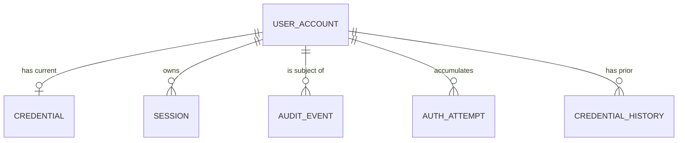
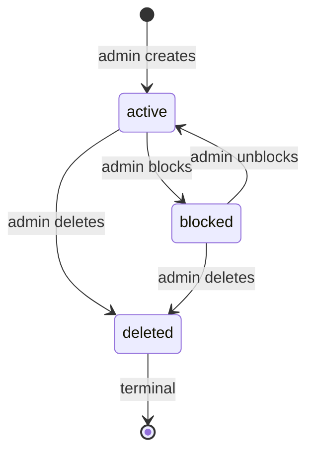

# Data Model: Authentication APIs

**Feature**: `001-authentication` | **Date**: 2026-08-03

**Source**: Key Entities in `spec.md`; decisions in `research.md`

Storage is PostgreSQL 17 (D-005). All identifiers are UUIDv7 for time-ordered index
locality. All timestamps are `timestamptz` in UTC.

---

## Entity Overview

---

## 1. UserAccount

Table `user_accounts`. Maps to the **User Account**, **Role**, and **Account Status**
entities in the spec.

| Field | Type | Constraints | Notes |
|-------|------|-------------|-------|
| `id` | `uuid` | PK | Stable identifier; never reused, survives deletion for audit |
| `login_identifier` | `citext` | UNIQUE, NULL when deleted | Email-formatted; case-insensitive (FR-006 duplicate guard) |
| `deleted_login_identifier` | `citext` | NULL unless deleted | Receives the identifier on soft delete (D-008) |
| `display_name` | `text` | NOT NULL, 1–100 chars | |
| `role` | `role_enum` | NOT NULL, default `user` | `user` \| `admin` (FR-003) |
| `status` | `status_enum` | NOT NULL, default `active` | `active` \| `blocked` \| `deleted` (`inactive` reserved for a future lifecycle feature; not reachable in this version) |
| `created_at` | `timestamptz` | NOT NULL | |
| `created_by` | `uuid` | FK → `user_accounts.id`, NULL | NULL for seeded bootstrap admin |
| `updated_at` | `timestamptz` | NOT NULL | |
| `updated_by` | `uuid` | FK → `user_accounts.id`, NULL | FR-009 attribution |
| `deleted_at` | `timestamptz` | NULL unless deleted | |
| `version` | `integer` | NOT NULL, default 1 | Optimistic concurrency for edits |

**Constraints**

- `CHECK`: `status = 'deleted'` requires `deleted_at IS NOT NULL` and
  `login_identifier IS NULL`.
- `CHECK`: `status <> 'deleted'` requires `login_identifier IS NOT NULL`.
- Partial unique index on `login_identifier WHERE status <> 'deleted'`.

**Indexes**: `login_identifier` (unique partial), `status`, `role`,
`(status, role) WHERE status = 'active' AND role = 'admin'` for the last-admin guard.

**Validation rules**

- `login_identifier` must be a valid email, max 254 chars (FR-014).
- `role` changes only via the dedicated role endpoint (D-010).
- Deleting or blocking the last `active` admin is rejected (FR-013).

### Status transitions

Only `active` permits authentication (FR-001, FR-002). `deleted` is terminal —
no restore path in this feature. `inactive` is reserved for a future
account-lifecycle feature and is intentionally unreachable in this version.

---

## 2. Credential

Table `credentials`. One current row per account. Raw secret material is never
stored or returned (FR-017).

| Field | Type | Constraints | Notes |
|-------|------|-------------|-------|
| `id` | `uuid` | PK | |
| `user_account_id` | `uuid` | FK → `user_accounts.id`, UNIQUE, ON DELETE CASCADE | One current credential |
| `credential_type` | `text` | NOT NULL, default `argon2id` | Supports future rotation |
| `password_hash` | `text` | NOT NULL | Encoded PHC string incl. salt + params (D-003) |
| `params` | `jsonb` | NOT NULL | Memory, iterations, parallelism as used |
| `policy_version` | `integer` | NOT NULL | Policy in force at set time |
| `last_changed_at` | `timestamptz` | NOT NULL | |
| `must_change` | `boolean` | NOT NULL, default false | Set for admin-created accounts |

**Validation rules** (FR-005, credential policy v1)

- Minimum 12 characters, maximum 256.
- Rejected if present in the bundled breached-credential list.
- Rejected if it matches any of the last 5 entries in `credential_history`.
- Rejected if identical to the current credential.
- New credential must differ from the `login_identifier`.

**Behavior**: On successful authentication, if `params` differ from current policy
parameters, the hash is transparently recomputed (D-003).

---

## 3. CredentialHistory

Table `credential_history`. Supports the reuse check above.

| Field | Type | Constraints |
|-------|------|-------------|
| `id` | `uuid` | PK |
| `user_account_id` | `uuid` | FK → `user_accounts.id`, ON DELETE CASCADE |
| `password_hash` | `text` | NOT NULL |
| `retired_at` | `timestamptz` | NOT NULL |

Retained to a maximum of 5 rows per account; older rows are pruned on insert.
Hashes are scrubbed on account deletion (D-008).

---

## 4. Session

Table `sessions`. Maps to the **Authentication Session** entity. Opaque
server-side tokens (D-004).

| Field | Type | Constraints | Notes |
|-------|------|-------------|-------|
| `id` | `uuid` | PK | |
| `user_account_id` | `uuid` | FK → `user_accounts.id`, NOT NULL | |
| `token_hash` | `bytea` | NOT NULL, UNIQUE | SHA-256 of the token; raw token never stored |
| `role_at_issue` | `role_enum` | NOT NULL | Recorded for audit only; authorization re-reads live role (D-010) |
| `issued_at` | `timestamptz` | NOT NULL | |
| `expires_at` | `timestamptz` | NOT NULL | `issued_at + 24h` |
| `revoked_at` | `timestamptz` | NULL | |
| `revoked_reason` | `text` | NULL | `logout` \| `credential_change` \| `blocked` \| `deleted` \| `admin_action` |
| `last_seen_at` | `timestamptz` | NOT NULL | |
| `client_ip` | `inet` | NULL | |
| `user_agent` | `text` | NULL | Truncated to 256 chars |

**Indexes**: `token_hash` (unique), `user_account_id`,
`(user_account_id) WHERE revoked_at IS NULL` for bulk revocation.

**Validity**: A session is valid when `revoked_at IS NULL` **and**
`expires_at > now()` **and** the owning account is `active`. The account check is
performed per request, so blocking takes effect immediately (FR-010, D-010).

**Revocation triggers** (FR-006): credential change revokes all sessions for the
account including the caller's; block and delete revoke all sessions; logout revokes
the current session.

---

## 5. AuditEvent

Table `audit_events`. Append-only; no `UPDATE` or `DELETE` grant for the
application role.

| Field | Type | Constraints | Notes |
|-------|------|-------------|-------|
| `id` | `uuid` | PK | |
| `action` | `text` | NOT NULL | Enumerated below |
| `outcome` | `text` | NOT NULL | `success` \| `failure` |
| `actor_id` | `uuid` | NULL | NULL for unauthenticated attempts; no FK so rows survive purge |
| `actor_role` | `role_enum` | NULL | |
| `subject_id` | `uuid` | NULL | Affected account; retained after deletion (D-008) |
| `occurred_at` | `timestamptz` | NOT NULL | |
| `client_ip` | `inet` | NULL | |
| `correlation_id` | `text` | NOT NULL | Request correlation (D-012) |
| `reason_code` | `text` | NULL | Specific denial reason, never surfaced publicly (D-007) |
| `context` | `jsonb` | NOT NULL, default `{}` | Non-sensitive detail only |

**Required actions** (FR-015): `auth.login.success`, `auth.login.failure`,
`auth.logout`, `credential.change`, `account.create`, `account.edit`,
`account.delete`, `account.block`, `account.unblock`, `account.role_change`,
`authz.denied`, `abuse.lockout`.

**Integrity rule**: The audit row is written in the same transaction as the action it
records (D-012), so SC-006 holds even under partial failure.

**Privacy rule**: `context` must never contain credential material, session tokens,
or password hashes (FR-017). Enforced by a redaction helper plus a unit test asserting
the forbidden-key set.

**Indexes**: `occurred_at`, `subject_id`, `actor_id`, `action`.

---

## 6. AuthAttempt

Table `auth_attempts`. Backs abuse protection (D-006). Not a spec entity; required by
FR-016 and SC-008.

| Field | Type | Constraints | Notes |
|-------|------|-------------|-------|
| `id` | `uuid` | PK | |
| `attempt_key` | `text` | NOT NULL | Normalized login identifier, or `ip:<addr>` |
| `key_type` | `text` | NOT NULL | `identifier` \| `ip` |
| `failure_count` | `integer` | NOT NULL, default 0 | |
| `window_started_at` | `timestamptz` | NOT NULL | |
| `locked_until` | `timestamptz` | NULL | Set when threshold is crossed |

**Unique**: `(attempt_key, key_type)`.

**Rules**

- Threshold: 5 failures within a 15-minute window → `locked_until = now() + 15m`.
- A locked key returns `429` with `Retry-After` before any credential verification.
- Successful authentication resets the identifier key's counter and clears its lock.
- Rows with `window_started_at` older than 24h are pruned by a periodic job.

---

## Referential and Retention Summary

| Concern | Rule |
|---------|------|
| Account deletion | Soft delete; credential hash scrubbed, history scrubbed, sessions revoked, identifier released (D-008) |
| Audit retention | Survives account deletion; `subject_id` intentionally has no FK constraint |
| Session cleanup | Expired rows pruned after 30 days; revocation state retained until then |
| Credential history | Max 5 rows retained per account |

## Bootstrap

A single `admin` account is seeded by migration with `must_change = true`. Its
credential is supplied via environment variable at first startup and is never
committed. This prevents a chicken-and-egg problem: FR-007 requires an admin to
create accounts, and FR-013 guarantees at least one active admin always exists.
