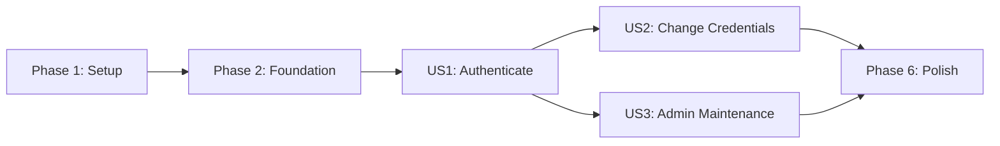

# Tasks: Authentication APIs

**Input**: Design documents from `/specs/001-authentication/`

**Prerequisites**: `plan.md`, `spec.md`, `research.md`, `data-model.md`, `contracts/openapi.yaml`, `quickstart.md`

**Tests**: Required by the project constitution, QV-002, QV-005, and the tasks template. Within each user story, write the listed tests first and confirm they fail before implementing the behavior.

**Organization**: Tasks are grouped by user story so each story produces an independently testable increment. All Go implementation paths are relative to `implementations/001-authentication/go-chi/` unless shown otherwise.

## Format: `[ID] [P?] [Story] Description`

- **[P]**: Can run in parallel because it touches different files and has no dependency on an incomplete task in the same phase
- **[Story]**: Maps the task to User Story 1, 2, or 3
- Every task includes an exact file path

---

## Phase 1: Setup (Shared Infrastructure)

**Purpose**: Create the reproducible container-first Go project and quality tooling.

- [ ] T001 Create the Go service directory structure from plan.md under implementations/001-authentication/go-chi/cmd/api/, internal/, and tests/
- [ ] T002 Initialize the Go 1.25 module and pin chi v5, pgx v5, x/crypto, validator v10, kin-openapi, golang-migrate, testify, and testcontainers-go in implementations/001-authentication/go-chi/go.mod
- [ ] T003 [P] Add the multi-stage Go build and distroless runtime image in implementations/001-authentication/go-chi/Dockerfile
- [ ] T004 [P] Define PostgreSQL 17 and API services, health checks, and migration startup in implementations/001-authentication/go-chi/docker-compose.yml
- [ ] T005 [P] Document required non-secret environment variables and bootstrap-admin inputs in implementations/001-authentication/go-chi/.env.example
- [ ] T006 [P] Configure gofmt, go vet, golangci-lint, gosec, govulncheck, unit tests, and race tests in implementations/001-authentication/go-chi/.golangci.yml and .github/workflows/authentication-go.yml

**Checkpoint**: The empty service can be built and its quality commands can run entirely through Docker.

---

## Phase 2: Foundational (Blocking Prerequisites)

**Purpose**: Implement shared storage, domain, HTTP, observability, and test infrastructure that every user story requires.

**Critical**: No user story work starts until this phase is complete.

- [ ] T007 Implement validated environment loading for database, HTTP, Argon2id, session, and bootstrap settings in implementations/001-authentication/go-chi/internal/config/config.go
- [ ] T008 [P] Define account, credential, session, audit-event, and auth-attempt domain types and enums in implementations/001-authentication/go-chi/internal/domain/models.go
- [ ] T009 Create PostgreSQL extensions, enums, six tables, constraints, indexes, and application-role grants from data-model.md in implementations/001-authentication/go-chi/internal/storage/migrations/000001_auth_schema.up.sql
- [ ] T010 [P] Add a complete rollback for the authentication schema in implementations/001-authentication/go-chi/internal/storage/migrations/000001_auth_schema.down.sql
- [ ] T011 Implement pgx pool initialization, health checks, and transaction helpers in implementations/001-authentication/go-chi/internal/storage/postgres/db.go
- [ ] T012 [P] Implement RFC 9457 Problem Details, stable error codes, field violations, and JSON writers in implementations/001-authentication/go-chi/internal/httpapi/problem/problem.go
- [ ] T013 [P] Implement JSON slog configuration, correlation IDs, and sensitive-key redaction in implementations/001-authentication/go-chi/internal/observability/logging.go
- [ ] T014 Implement transactional append-only audit event persistence with the FR-015 action constants in implementations/001-authentication/go-chi/internal/audit/writer.go
- [ ] T015 [P] Implement panic recovery, request correlation, JSON content negotiation, and request-size limiting middleware in implementations/001-authentication/go-chi/internal/httpapi/middleware/common.go
- [ ] T016 Compose the chi router, health endpoint, shared middleware, and graceful HTTP shutdown in implementations/001-authentication/go-chi/internal/httpapi/router.go and implementations/001-authentication/go-chi/cmd/api/main.go
- [ ] T017 [P] Build reusable PostgreSQL testcontainers, migration, fixture, and HTTP test helpers in implementations/001-authentication/go-chi/tests/testsupport/environment.go
- [ ] T018 Seed the first active admin from environment input with must_change enabled and no committed credential in implementations/001-authentication/go-chi/internal/bootstrap/admin.go
- [ ] T019 Document credential threats, enumeration and timing threats, token theft, privilege escalation, abuse controls, and residual risks in specs/001-authentication/threat-model.md

**Checkpoint**: Database migrations, shared HTTP behavior, audit writes, bootstrap, and isolated test infrastructure are ready; all user-story work is unblocked.

---

## Phase 3: User Story 1 - User Authenticates Account (Priority: P1) MVP

**Goal**: An active registered user can log in and receive an opaque session token; invalid, blocked, inactive, deleted, and unknown accounts are denied uniformly; repeated failures trigger abuse protection; logout revokes the session.

**Independent Test**: Seed active, blocked, inactive, and deleted accounts; verify only valid credentials for the active account return a token, every denial has the same safe 401 contract, the sixth failure in the configured window returns 429, and logout makes the issued token unusable.

### Tests for User Story 1

- [ ] T020 [P] [US1] Add OpenAPI-backed contract tests for POST /v1/auth/login and POST /v1/auth/logout responses in implementations/001-authentication/go-chi/tests/contract/auth_test.go
- [ ] T021 [P] [US1] Add integration tests for valid login, invalid credentials, blocked, inactive, deleted, and unknown accounts in implementations/001-authentication/go-chi/tests/integration/login_test.go
- [ ] T022 [P] [US1] Add integration tests comparing unknown-account and invalid-password response bodies and timing distributions in implementations/001-authentication/go-chi/tests/integration/enumeration_test.go
- [ ] T023 [P] [US1] Add integration tests for opaque token storage, expiry, logout revocation, and account-status rechecks in implementations/001-authentication/go-chi/tests/integration/session_test.go
- [ ] T024 [P] [US1] Add integration tests for identifier and IP failure counters, the five-attempt threshold, 15-minute lockout, Retry-After, and audit events in implementations/001-authentication/go-chi/tests/integration/throttle_test.go
- [ ] T025 [P] [US1] Add unit tests for Argon2id PHC encoding, verification, dummy-hash verification, parameter upgrades, and token generation in implementations/001-authentication/go-chi/internal/credential/hasher_test.go and implementations/001-authentication/go-chi/internal/auth/token_test.go

### Implementation for User Story 1

- [ ] T026 [P] [US1] Implement Argon2id hashing, PHC parsing, constant-time verification, dummy-hash verification, and parameter upgrade detection in implementations/001-authentication/go-chi/internal/credential/hasher.go
- [ ] T027 [P] [US1] Implement 256-bit opaque token generation and SHA-256 token hashing in implementations/001-authentication/go-chi/internal/auth/token.go
- [ ] T028 [US1] Implement account-and-credential lookup plus session create, resolve, revoke, and expiry queries in implementations/001-authentication/go-chi/internal/storage/postgres/auth_repository.go
- [ ] T029 [US1] Implement durable identifier/IP attempt counters, rolling windows, lockouts, reset, and stale-row cleanup in implementations/001-authentication/go-chi/internal/throttle/service.go and implementations/001-authentication/go-chi/internal/storage/postgres/throttle_repository.go
- [ ] T030 [US1] Implement login orchestration with uniform denials, dummy hashing, status checks, throttling, session issuance, and transactional success/failure audit events in implementations/001-authentication/go-chi/internal/auth/service.go
- [ ] T031 [US1] Implement bearer-session resolution that rechecks live account role and status on every request in implementations/001-authentication/go-chi/internal/httpapi/middleware/session.go
- [ ] T032 [US1] Implement login and logout request decoding, validation, Problem Details mapping, and response serialization in implementations/001-authentication/go-chi/internal/httpapi/handlers/auth.go
- [ ] T033 [US1] Register POST /v1/auth/login and POST /v1/auth/logout with public and authenticated middleware policies in implementations/001-authentication/go-chi/internal/httpapi/router.go

**Checkpoint**: User Story 1 passes its contract, integration, and unit tests and is deployable as the authentication MVP.

---

## Phase 4: User Story 2 - User Changes Credentials (Priority: P2)

**Goal**: An authenticated active user can prove their current password and set a policy-compliant replacement; the old password stops working and every existing session is revoked.

**Independent Test**: Log in as a user, change the password with correct proof, verify the caller and all other sessions are revoked, verify the old password fails and the new one succeeds, and verify wrong-current, weak, breached, reused, and concurrent changes leave one valid final state.

**Dependency**: Requires the authentication and session capability delivered by User Story 1; it does not require User Story 3.

### Tests for User Story 2

- [ ] T034 [P] [US2] Add an OpenAPI-backed contract test for PUT /v1/me/password success and Problem Details responses in implementations/001-authentication/go-chi/tests/contract/password_test.go
- [ ] T035 [P] [US2] Add integration tests for correct and incorrect current passwords, old/new login behavior, and revocation of all sessions in implementations/001-authentication/go-chi/tests/integration/password_change_test.go
- [ ] T036 [P] [US2] Add integration tests for concurrent password changes producing one complete final state with no partial history or session updates in implementations/001-authentication/go-chi/tests/integration/password_concurrency_test.go
- [ ] T037 [P] [US2] Add unit tests for length, login-identifier, bundled breached-password, current-password, and last-five reuse rules in implementations/001-authentication/go-chi/internal/credential/policy_test.go

### Implementation for User Story 2

- [ ] T038 [P] [US2] Add the versioned bundled breached-credential hash set and lookup implementation in implementations/001-authentication/go-chi/internal/credential/breached_passwords.txt and implementations/001-authentication/go-chi/internal/credential/breached.go
- [ ] T039 [US2] Implement credential policy evaluation and stable field-level violation codes in implementations/001-authentication/go-chi/internal/credential/policy.go
- [ ] T040 [US2] Implement row-locked credential replacement, five-entry history maintenance, and all-session revocation queries in implementations/001-authentication/go-chi/internal/storage/postgres/credential_repository.go
- [ ] T041 [US2] Implement atomic current-password proof, policy checks, Argon2id replacement, history update, session revocation, and audit writing in implementations/001-authentication/go-chi/internal/credential/service.go
- [ ] T042 [US2] Implement PUT /v1/me/password decoding, validation, Problem Details responses, and route registration in implementations/001-authentication/go-chi/internal/httpapi/handlers/credential.go and implementations/001-authentication/go-chi/internal/httpapi/router.go

**Checkpoint**: User Story 2 passes independently using a seeded active user and the US1 login capability; admin maintenance is not required.

---

## Phase 5: User Story 3 - Admin Maintains User Accounts (Priority: P3)

**Goal**: An authenticated admin can create, list/search, view, edit, block, unblock, delete, and explicitly change roles while non-admins are denied and the last active admin remains protected.

**Independent Test**: Authenticate as an admin and execute every maintenance operation, checking account state, immediate access effects, safe response fields, and audit records; repeat every route as a regular user and verify denial; concurrently attempt to remove the last active admins and verify at least one remains.

**Dependency**: Requires the authentication, session, and live-role middleware delivered by User Story 1; it does not require User Story 2.

### Tests for User Story 3

- [ ] T043 [P] [US3] Add OpenAPI-backed contract tests for all admin user-list, create, detail, edit, delete, block, unblock, and role endpoints in implementations/001-authentication/go-chi/tests/contract/admin_users_test.go
- [ ] T044 [P] [US3] Add integration tests for admin create, bounded search/list, view, edit, duplicate identifier, and credential-field exclusion in implementations/001-authentication/go-chi/tests/integration/admin_account_test.go
- [ ] T045 [P] [US3] Add integration tests for block/unblock, immediate session revocation, soft deletion, identifier release, and retained audit linkage in implementations/001-authentication/go-chi/tests/integration/admin_status_test.go
- [ ] T046 [P] [US3] Add integration tests for non-admin denial and audit events on every admin route in implementations/001-authentication/go-chi/tests/integration/admin_authorization_test.go
- [ ] T047 [P] [US3] Add integration tests for explicit role changes and concurrent block, delete, or demotion attempts against the last active admins in implementations/001-authentication/go-chi/tests/integration/last_admin_test.go

### Implementation for User Story 3

- [ ] T048 [P] [US3] Implement role-required middleware with transactional authorization-denial audit events in implementations/001-authentication/go-chi/internal/httpapi/middleware/authorization.go
- [ ] T049 [US3] Implement account create, paginated/filterable list, detail, and permitted-edit PostgreSQL queries in implementations/001-authentication/go-chi/internal/storage/postgres/account_repository.go
- [ ] T050 [US3] Implement row-locked block, unblock, soft-delete, identifier-release, session-revocation, and last-active-admin queries in implementations/001-authentication/go-chi/internal/storage/postgres/account_status_repository.go
- [ ] T051 [US3] Implement explicit role changes with authorization, last-active-admin protection, and session role refresh behavior in implementations/001-authentication/go-chi/internal/storage/postgres/account_role_repository.go
- [ ] T052 [US3] Implement account creation, privacy-bounded reads, edits, status transitions, role changes, conflict mapping, and transactional audit events in implementations/001-authentication/go-chi/internal/account/service.go
- [ ] T053 [US3] Implement admin list/create/detail/edit/delete/block/unblock/role HTTP handlers with stable Problem Details responses in implementations/001-authentication/go-chi/internal/httpapi/handlers/admin_users.go
- [ ] T054 [US3] Register all /v1/admin/users routes behind session and admin-role middleware in implementations/001-authentication/go-chi/internal/httpapi/router.go

**Checkpoint**: All three user stories are functional, contract-conformant, auditable, and independently testable with their documented prerequisites.

---

## Phase 6: Polish & Cross-Cutting Concerns

**Purpose**: Complete shared conformance, performance, security, documentation, and release evidence across all stories.

- [ ] T055 [P] Create language-agnostic valid, invalid, state-transition, and security-edge fixtures in specs/001-authentication/test-vectors/authentication.json
- [ ] T056 Implement cross-language conformance coverage for authentication, password change, admin maintenance, error consistency, and audit outcomes in tests/conformance/001-authentication/authentication_test.js
- [ ] T057 [P] Implement k6 login, credential-change, and admin-list workloads with p50, p95 under 500ms, throughput, and error-rate thresholds in specs/001-authentication/benchmark-scenarios/auth-load.js
- [ ] T058 Run the benchmark with production Argon2id parameters and record environment, p50, p95, throughput, errors, CPU, and memory in benchmarks/reports/001-authentication-go-chi.md
- [ ] T059 [P] Add cleanup jobs for expired sessions and stale abuse-counter rows in implementations/001-authentication/go-chi/internal/maintenance/cleanup.go
- [ ] T060 Run gofmt, go vet, golangci-lint, gosec, govulncheck, race tests, contract tests, integration tests, and conformance tests and capture the commands and results in benchmarks/reports/001-authentication-go-chi.md
- [ ] T061 Validate every scenario in specs/001-authentication/quickstart.md against the containerized service and correct any mismatched commands or expected responses in specs/001-authentication/quickstart.md
- [ ] T062 Review OpenAPI operations, Problem Details codes, logs, audit context, and account responses for FR-014/FR-017 consistency and update specs/001-authentication/contracts/openapi.yaml where discrepancies are found

---

## Dependencies & Execution Order

### Phase Dependencies

- **Phase 1 Setup**: No dependencies; starts immediately.
- **Phase 2 Foundational**: Depends on Phase 1 and blocks every user story.
- **Phase 3 US1**: Depends on Phase 2 and is the MVP.
- **Phase 4 US2**: Depends on Phase 2 plus US1 authentication/session behavior.
- **Phase 5 US3**: Depends on Phase 2 plus US1 authentication/live-role behavior; independent of US2.
- **Phase 6 Polish**: T055 and T057 can start once the contract is stable; executable validation tasks require all selected stories.

### User Story Completion Order



- **US1 (P1)**: No story dependency; deployable MVP after foundation.
- **US2 (P2)**: Depends on US1 for login and session revocation; independently tested without US3.
- **US3 (P3)**: Depends on US1 for admin authentication and live role/status checks; independently tested without US2.
- After US1, US2 and US3 can proceed in parallel with separate owners.

### Within Each User Story

1. Add the story's tests and confirm they fail for the expected missing behavior.
2. Implement domain primitives and persistence.
3. Implement orchestration services and transactional audit behavior.
4. Implement handlers, middleware, and route registration.
5. Run the story's contract, integration, and unit tests before starting dependent work.

---

## Parallel Opportunities

### Setup and Foundation

- T003, T004, T005, and T006 can run in parallel after T002 establishes the module.
- T008, T010, T012, T013, T015, and T017 touch distinct files and can run in parallel while T009/T011 establish the database path.

### User Story 1

```text
Parallel test batch: T020, T021, T022, T023, T024, T025
Parallel implementation batch after tests fail: T026 and T027
Then sequential integration: T028 -> T029 -> T030 -> T031 -> T032 -> T033
```

### User Story 2

```text
Parallel test batch: T034, T035, T036, T037
Parallel implementation start: T038 while T039 begins after policy tests
Then sequential integration: T039 -> T040 -> T041 -> T042
```

### User Story 3

```text
Parallel test batch: T043, T044, T045, T046, T047
Parallel middleware work: T048 while account persistence begins
Then persistence/service/API: T049 -> T050 -> T051 -> T052 -> T053 -> T054
```

### Cross-Story

Once US1 passes, one owner can execute T034-T042 for US2 while another executes T043-T054 for US3. T055 and T057 are also parallel because they affect separate shared artifacts.

---

## Implementation Strategy

### MVP First

1. Complete Setup (T001-T006).
2. Complete Foundation (T007-T019).
3. Complete User Story 1 tests and implementation (T020-T033).
4. Validate login denial uniformity, lockout, token issuance, and logout independently.
5. Deploy or demonstrate the authentication MVP before expanding scope.

### Incremental Delivery

1. **MVP**: US1 provides secure authentication and session lifecycle.
2. **Increment 2**: US2 adds user-owned credential rotation and session invalidation.
3. **Increment 3**: US3 adds operational account administration and authorization guards.
4. **Release hardening**: Shared conformance, benchmark, security, and quickstart validation complete the feature.

### Task Completeness Validation

- All 12 OpenAPI operations map to contract-test and implementation tasks.
- All 18 functional requirements map to foundation or story tasks.
- Every user story has explicit independent test criteria and test-first tasks.
- Data entities and relationships from data-model.md map to migrations, repositories, services, and integration tests.
- Constitution gates map to lint/security tasks, automated tests, Problem Details validation, performance evidence, threat modeling, and documentation validation.
